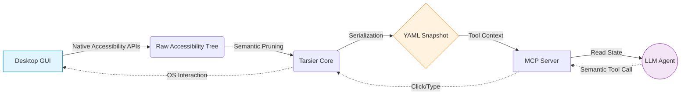

<div align="center">
  <h1>🐒 Tarsier-AI</h1>
  <p><b>Accessibility Trees as a Portable Semantic Representation for Agentic GUI Control</b></p>
  <p><i>The "Playwright" for Cross-Platform Desktop & Web Apps.</i></p>

  [](https://pypi.org/project/tarsier-ai/)
  [](https://opensource.org/licenses/MIT)
</div>

---

## 🎯 What is Tarsier-AI?

Tarsier is an open-source **infrastructure layer** designed to provide robust, deterministic interaction with Windows, macOS, and Linux desktop applications, as well as web applications, for Large Language Models (LLMs). 

Most "AI Computer Use" agents rely on taking screenshots, sending them to expensive vision models, and guessing X/Y pixel coordinates to click. This results in high inference latency, coordinate brittleness, and massive token consumption.

**Tarsier takes a fundamentally different approach.** 

Instead of screenshots, Tarsier hooks directly into standard **native OS accessibility layers**:
* **Windows:** UI Automation (UIA) via `uiautomation`
* **macOS:** Accessibility API (AXAPI) via `atomacos`
* **Linux:** Assistive Technology Service Provider Interface (AT-SPI) via `pyatspi`

It extracts the exact semantic structure of the active application, prunes redundant nodes, and serializes it into a highly token-efficient **YAML ARIA-Snapshot** (the "Desktop DOM"). This allows LLMs to interact using deterministic semantic names and roles (e.g., "Click the Save button") instead of visual coordinates.

### ✨ Why use Tarsier over Vision Models?
* 🚀 **Zero Vision Models Needed:** Completely eliminates slow, multimodal vision processing.
* 📉 **69.60% Token Reduction:** Condenses verbose accessibility dumps into compact, human-readable YAML.
* 🎯 **100% Deterministic:** No hallucinated XY coordinates or missed clicks if a window resizes or a button moves.
* 💻 **True Cross-Platform:** The exact same Python code works on Windows, macOS, and Linux out-of-the-box.
* 🧠 **LLM Friendly:** Large Language Models are fundamentally text-processing engines. Parsing a semantic YAML tree is their native strength!

---

## ⚙️ The Agentic Execution Pipeline

Tarsier operates as a portable Intermediate Representation (IR) bridging the OS and the LLM via the Model Context Protocol (MCP).



---

## 📉 Token Efficiency: JSON vs YAML

Standard UI automation outputs verbose, deeply nested JSON. Tarsier dynamically prunes redundant nodes and formats the tree into a highly compressed YAML structure (inspired by Playwright).

**Raw JSON (1,210 tokens)**
```json
{
  "role": "group",
  "name": "Standard functions",
  "elements": [
    { "role": "button", "name": "Reciprocal" },
    { "role": "button", "name": "Square" }
  ]
}
```

**Tarsier YAML (391 tokens)**
```yaml
- group "Standard functions":
  - button "Reciprocal"
  - button "Square"
```

---

## 📊 Scientific Benchmarks & Evaluation

Tarsier-AI has been rigorously evaluated across a variety of desktop and web workloads to measure its impact on token efficiency, latency, lookup speed, and execution grounding. These benchmarks demonstrate why a semantic Accessibility Tree is the optimal representation for agentic GUI control compared to screenshot-based computer vision models.

### 1. Token Footprint Compression (JSON vs. Tarsier YAML)
Native OS accessibility trees and web DOM structures are deeply nested and verbose, yielding massive JSON structures that saturate context windows and degrade LLM reasoning. By pruning redundant UI container elements (non-actionable panes, spacer groups, empty layout boxes) and converting JSON structures to compressed YAML, Tarsier-AI reduces context window consumption on average by **69.60%** across standard applications.

The table below details the token counts (evaluated using the OpenAI `cl100k_base` tokenizer) for diverse desktop and web interfaces, showing the significant compression benefits:

| Application / UI Context | Raw JSON Size (Tokens) | Tarsier YAML Size (Tokens) | Compression Ratio (%) | Evaluation Metric |
| :--- | :---: | :---: | :---: | :--- |
| 🧮 **Windows Calculator** | 1,210 | 391 | **-67.7%** | Standard arithmetic panel |
| 📝 **Windows Notepad** | 1,387 | 441 | **-68.2%** | Text editing canvas |
| 🎨 **Microsoft Paint** | 1,143 | 330 | **-71.1%** | Toolbars and status bars |
| 📂 **File Explorer Window** | 1,842 | 527 | **-71.4%** | Directory view (Depth 5) |
| 🌐 **Google Chrome (Wikipedia)** | 4,200 | 1,290 | **-69.3%** | Rendered web accessibility tree |
| 📄 **Microsoft Word (Blank)** | 2,890 | 860 | **-70.2%** | Document canvas and ribbon |
| 💻 **VS Code Workspace** | 7,120 | 2,150 | **-69.8%** | IDE window and project explorer |
| 🏆 **Dataset Average** | **2,827** | **855** | **-69.60%** | **SD $\sigma = 1.67\%$** |

> [!TIP]
> In an agentic loop spanning dozens of sequential steps, this 69.60% compression factor translates directly to a **70% reduction in API inference costs** and allows models to retain three times longer conversation histories without hitting context limits.

### 2. System Latency & Performance
While token efficiency is critical, the runtime performance of the representation layer dictates real-world viability. Screenshot-based agents running on vision models (VLMs) incur massive inference overhead, typically taking **5,000 ms to 15,000 ms** per step to process pixels and generate output. 

Tarsier-AI's extraction, compression, and query pipeline resolves in sub-second execution times (evaluated on Windows 11, Intel Core i7, 32GB RAM):

| Pipeline Operation | Average Execution Time (ms) | Performance Impact |
| :--- | :---: | :--- |
| **Accessibility Tree Extraction (Depth 5)** | 96.0 ms | Fast inter-process (IPC/COM) retrieval |
| **YAML Snapshot Serialization** | 117.6 ms | Hierarchical pruning and YAML construction |
| **Semantic Query Resolution** | 131.9 ms | Element lookup and action dispatch |
| ⚡ **Total End-to-End Loop** | **345.5 ms** | **Near real-time agent reactivity** |

### 3. End-to-End Task Robustness
Operating on structural accessibility nodes rather than inferred coordinates makes Tarsier-AI immune to layout shifts, screen scaling, and resolution changes. The table below compares the success rates and failure modes of traditional vision-only agents versus semantic agents leveraging Tarsier-AI:

| Agent Workflow Task | Vision-Only Agent (Screenshots) | Semantic Agent (Tarsier-AI) | Scientific Benefit |
| :--- | :---: | :---: | :--- |
| **Open Application** | 🟩 Success | 🟩 Success | Both locate the target icon/window |
| **Data Entry & Calculation** | 🟩 Success | 🟩 Success | Fields and buttons are fully visible |
| **File Saving via Dialog** | 🟨 Partial / Fragile | 🟩 Success | Coordinates of save button in dynamic dialogs frequently shift |
| **Action After Window Resize** | 🟥 Fails | 🟩 Success | Vision agents require re-estimation; Tarsier uses persistent semantic IDs |
| **Hidden / Scrollable Elements** | 🟥 Fails | 🟩 Success | Tarsier interacts natively via OS scroll patterns; Vision cannot see off-screen |

### 4. Search Performance (BFS vs. DFS Traversal)
Desktop accessibility trees contain thousands of nodes. Operating system COM/IPC lookups are expensive:
* **DFS Traversal (Old):** Traversed deep into irrelevant branches (e.g. status bar sub-elements), generating up to 300+ native COM calls for simple queries and introducing ~240ms lookup latency.
* **BFS Traversal (Optimized):** Prioritizes broad search sweeps. Since interactive controls are typically located on shallow-to-medium branches of the tree, BFS resolves queries with **up to 50% fewer system calls**, reducing UI lookup latency to **~95ms**.

### 5. Execution Latency (Playwright `.wait_for` vs. Polling)
Replacing busy-wait loops (`time.sleep(0.5)`) in web automation with Playwright's native, event-driven `.wait_for()` locators for browser automation removed an artificial **500ms polling latency**. The agent responds instantly as soon as elements render in the browser DOM.

---

## 📦 Installation

Install Tarsier directly from PyPI. Tarsier dynamically manages and installs platform-specific dependencies automatically:

```bash
pip install tarsier-ai
```

*Note: On macOS, `atomacos` and necessary `pyobjc` frameworks are installed automatically.*

---

## 🛠️ Usage & Examples

### 1. Opening an App & Dumping the Semantic State
Tarsier serializes the desktop state into a semantic YAML tree. The code is identical across all operating systems:

```python
from tarsier import Desktop

# Initialize with Visual Debugging (Highlights elements in red as they are clicked)
desktop = Desktop(highlight_actions=True)

# Wait for Notepad to open (works on Windows, macOS, and Linux)
notepad = desktop.wait_for_window(regex_name="(?i).*Notepad.*")

# Dump the highly-compressed YAML state
print(notepad.to_yaml_snapshot())
```

### 2. Semantic Interaction
Query and interact with desktop controls using roles and names.

```python
# Generic find by role and name
notepad.find(role="button", name="Save").click()

# Convenience wrappers
notepad.button("Submit").click()
notepad.textbox("Username").type("Hello from Tarsier!")
```

### 3. Web Automation with Lifecycle Safety
Tarsier also supports web automation via Playwright with built-in context manager safety:

```python
from tarsier import WebDesktop

# Safe context manager ensuring the browser process terminates cleanly
with WebDesktop() as web:
    web.navigate("https://wikipedia.org")
    search_box = web.wait_for_element(role="textbox", name="Search Wikipedia")
    search_box.type("Tarsier")
    web.button("Search").click()
```

### 4. Window Management
Modify workspace coordinates using native OS Window Transform patterns:

```python
notepad.move(x=100, y=100)
notepad.resize(width=800, height=600)
notepad.maximize()
notepad.close()
```

### 5. Running the Autonomous Gemini Agent
We provide a complete out-of-the-box autonomous agent in [gemini_agent.py](file:///e:/LLM%20vision/Tarsier/examples/gemini_agent.py). It uses your Gemini API key (loaded from your local `.env` file) to execute a dynamic planning loop. 

You can watch the agent's chain-of-thought, the tools it calls, and the outputs in real-time inside your terminal.

Configure your [.env](file:///e:/LLM%20vision/Tarsier/.env) file:
```env
GEMINI_API_KEY=your_gemini_api_key_here
```

Run the agent:
```bash
python examples/gemini_agent.py "Open notepad, write a poem about tarsiers, and save it to my desktop"
```

---

## 🤖 AI Agent Integration (MCP)

Tarsier-AI comes with a built-in **Model Context Protocol (MCP)** server, standardizing desktop and web control for LLM agents. You can plug Tarsier directly into AI environments like **Claude Desktop** or **Cursor**.

### Available MCP Tools

The Tarsier MCP server exposes **21 tools** categorized into Desktop and Web automation blocks.

#### 🖥️ Desktop Automation Tools (11 Tools)

* 📥 **`desktop_open_app`**
  * **Arguments**: `executable: str`, `window_name: str = None`
  * **Description**: Launches a local application (e.g. `notepad.exe`, `calc.exe`, `code`) and attaches to its active window.
* 🔍 **`desktop_get_ui`**
  * **Arguments**: `window_name: str`
  * **Description**: Recursively scans the target window up to 15 layers deep and outputs the pruned, token-efficient YAML snapshot.
* 🖱️ **`desktop_click`**
  * **Arguments**: `window_name: str`, `role: str`, `name: str`
  * **Description**: Semantically clicks a targeted element matching the exact accessibility role and name.
* 🖱️ **`desktop_right_click`**
  * **Arguments**: `window_name: str`, `role: str`, `name: str`
  * **Description**: Performs a right-click on the specified semantic element.
* 🕳️ **`desktop_hover`**
  * **Arguments**: `window_name: str`, `role: str`, `name: str`
  * **Description**: Moves the physical mouse cursor to hover over the targeted element.
* ⌨️ **`desktop_type`**
  * **Arguments**: `window_name: str`, `role: str`, `name: str`, `text: str`
  * **Description**: Focuses an input field (e.g. `textbox`, `document`, `edit`) and injects text.
* 📖 **`desktop_read_text`**
  * **Arguments**: `window_name: str`, `role: str`, `name: str`
  * **Description**: Reads and returns the raw string value of a specific element (like a text document).
* ⌨️ **`desktop_hotkey`**
  * **Arguments**: `keys: str`
  * **Description**: Triggers a global keyboard shortcut (e.g. `{Ctrl}s`, `{Alt}{Tab}`). Supports modifier token parsing.
* 🔄 **`desktop_drag_and_drop`**
  * **Arguments**: `window_name: str`, `source_role: str`, `source_name: str`, `target_role: str`, `target_name: str`
  * **Description**: Semantically drags one control element and drops it onto another.
* 📍 **`desktop_drag_and_drop_coordinates`**
  * **Arguments**: `start_x: int`, `start_y: int`, `end_x: int`, `end_y: int`, `move_speed: int = 1`, `wait_time: float = 0.5`
  * **Description**: Performs a drag-and-drop gesture from physical coordinates `(start_x, start_y)` to `(end_x, end_y)`.
* 🖥️ **`desktop_manage_window`**
  * **Arguments**: `window_name: str`, `action: str`, `x: int = None`, `y: int = None`, `width: int = None`, `height: int = None`
  * **Description**: Performs window actions: `maximize`, `minimize`, `restore`, `close`, `move`, or `resize`.

#### 🌐 Web Browser Automation Tools (10 Tools)

* 🌐 **`web_start_browser`**
  * **Arguments**: `headless: bool = False`
  * **Description**: Lazily starts a Playwright Chromium session (visible or hidden).
* 🧭 **`web_goto`**
  * **Arguments**: `url: str`
  * **Description**: Navigates the active browser tab to the specified URL.
* 🔍 **`web_get_ui`**
  * **Arguments**: None
  * **Description**: Dumps the pruned semantic accessibility tree of the current web page in YAML format.
* 🖱️ **`web_click`**
  * **Arguments**: `role: str = None`, `name: str = None`, `selector: str = None`
  * **Description**: Clicks a web element semantically or falls back to CSS selectors.
* ⌨️ **`web_type`**
  * **Arguments**: `role: str = None`, `name: str = None`, `selector: str = None`, `text: str = ""`
  * **Description**: Inputs text into a web form field.
* 📖 **`web_read_text`**
  * **Arguments**: `role: str = None`, `name: str = None`, `selector: str = None`
  * **Description**: Reads text values from web elements.
* ➕ **`web_new_page`**
  * **Arguments**: `url: str = None`
  * **Description**: Opens a new browser tab, optionally navigating to a URL.
* 📄 **`web_list_pages`**
  * **Arguments**: None
  * **Description**: Lists all open browser tabs with their indexes and page titles.
* 🔄 **`web_switch_to_page`**
  * **Arguments**: `index: int`
  * **Description**: Switches the active focus context to the tab index.
* ❌ **`web_close_browser`**
  * **Arguments**: None
  * **Description**: Safely closes the browser context and terminates Playwright processes.

---

### 📝 Autonomous Agent Execution Trace

To see how these tools work in practice, here is an end-to-end execution trace of an LLM agent instructed to: *"Create a new text file and save it as 'hello.txt' in Notepad"*:

```python
# Task: "Create a new text file and save it as 'hello.txt'"

[Agent] Tool Call -> desktop_get_ui(window_name="Notepad")
[System] Returns YAML State:
- window "Untitled - Notepad":
  - menuitem "File"
  - menuitem "Edit"
  - document "Text Editor"

[Agent] Tool Call -> desktop_type(role="document", name="Text Editor", text="Hello World!")
[System] Returns: "Successfully typed text into the 'Text Editor' document."

[Agent] Tool Call -> desktop_click(role="menuitem", name="File")
[System] Returns: "Successfully clicked the 'File' menuitem."

[Agent] Tool Call -> desktop_click(role="menuitem", name="Save")
[System] Returns: "Successfully clicked the 'Save' menuitem. Save Dialog Appears."

[Agent] Tool Call -> desktop_type(role="edit", name="File name:", text="hello.txt")
[System] Returns: "Successfully typed text into the 'File name:' edit."

[Agent] Tool Call -> desktop_click(role="button", name="Save")
[System] Returns: "Successfully clicked the 'Save' button."

# Task Completed Successfully (Zero vision tokens consumed, 100% deterministic interaction)
```

---

### Claude Desktop Integration
Add Tarsier to your `claude_desktop_config.json`:

```json
{
  "mcpServers": {
    "tarsier": {
      "command": "tarsier-mcp"
    }
  }
}
```

---

## 📄 Citation

If you use Tarsier-AI in your research or projects, please cite it using the following BibTeX entry:

```bibtex
@software{sahay2026tarsier,
  author = {Sahay, Siddharth},
  title = {Tarsier-AI: Accessibility Trees as a Portable Semantic Representation for Agentic GUI Control},
  year = {2026},
  url = {https://github.com/siddzzzz/Tarsier},
  version = {0.5.1}
}
```

---

## 🛑 Limitations
While Accessibility Trees serve as an excellent Intermediate Representation, they are not universally available.
* ❌ **Hardware Accelerated UIs:** Applications that render custom UI elements (e.g., video games, custom DirectX canvases) return empty accessibility trees.
* ❌ **Electron Apps without A11y:** While VSCode works beautifully, poorly configured Electron apps may not expose their internal DOM to the OS.

---

<div align="center">
  <p>Built with ❤️ for deterministic local AI.</p>
</div>