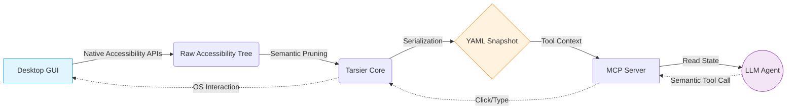

<div align="center">
  <h1>🐒 Tarsier-AI</h1>
  <p><b>Accessibility Trees as a Portable Semantic Representation for Agentic GUI Control</b></p>
  <p><i>The "Playwright" for Cross-Platform Desktop & Web Apps.</i></p>

  [](https://pypi.org/project/tarsier-ai/)
  [](https://opensource.org/licenses/MIT)
</div>

---

## 🎯 What is Tarsier-AI?

Tarsier is an open-source **infrastructure layer** designed to provide robust, deterministic interaction with Windows, macOS, and Linux desktop applications, as well as web applications, for Large Language Models (LLMs). 

Most "AI Computer Use" agents rely on taking screenshots, sending them to expensive vision models, and guessing X/Y pixel coordinates to click. This results in high inference latency, coordinate brittleness, and massive token consumption.

**Tarsier takes a fundamentally different approach.** 

Instead of screenshots, Tarsier hooks directly into standard **native OS accessibility layers**:
* **Windows:** UI Automation (UIA) via `uiautomation`
* **macOS:** Accessibility API (AXAPI) via `atomacos`
* **Linux:** Assistive Technology Service Provider Interface (AT-SPI) via `pyatspi`

It extracts the exact semantic structure of the active application, prunes redundant nodes, and serializes it into a highly token-efficient **YAML ARIA-Snapshot** (the "Desktop DOM"). This allows LLMs to interact using deterministic semantic names and roles (e.g., "Click the Save button") instead of visual coordinates.

### ✨ Why use Tarsier over Vision Models?
* 🚀 **Zero Vision Models Needed:** Completely eliminates slow, multimodal vision processing.
* 📉 **69.6% Token Reduction:** Condenses verbose accessibility dumps into compact, human-readable YAML.
* 🎯 **100% Deterministic:** No hallucinated XY coordinates or missed clicks if a window resizes or a button moves.
* 💻 **True Cross-Platform:** The exact same Python code works on Windows, macOS, and Linux out-of-the-box.
* 🧠 **LLM Friendly:** Large Language Models are fundamentally text-processing engines. Parsing a semantic YAML tree is their native strength!

---

## ⚙️ The Agentic Execution Pipeline

Tarsier operates as a portable Intermediate Representation (IR) bridging the OS and the LLM via the Model Context Protocol (MCP).



---

## 📉 Token Efficiency: JSON vs YAML

Standard UI automation outputs verbose, deeply nested JSON. Tarsier dynamically prunes redundant nodes and formats the tree into a highly compressed YAML structure (inspired by Playwright).

Our empirical benchmarks across native Calculator, Notepad, and File Explorer apps demonstrate a **highly consistent ~69.6% reduction** in token consumption.

**Raw JSON (1,210 tokens)**
```json
{
  "role": "group",
  "name": "Standard functions",
  "elements": [
    { "role": "button", "name": "Reciprocal" },
    { "role": "button", "name": "Square" }
  ]
}
```

**Tarsier YAML (391 tokens)**
```yaml
- group "Standard functions":
  - button "Reciprocal"
  - button "Square"
```

---

## 📦 Installation

Install Tarsier directly from PyPI. Tarsier dynamically manages and installs platform-specific dependencies automatically:

```bash
pip install tarsier-ai
```

*Note: On macOS, `atomacos` and necessary `pyobjc` frameworks are installed automatically.*

---

## 🛠️ Usage & Examples

### 1. Opening an App & Dumping the Semantic State
Tarsier serializes the desktop state into a semantic YAML tree. The code is identical across all operating systems:

```python
from tarsier import Desktop

# Initialize with Visual Debugging (Highlights elements in red as they are clicked)
desktop = Desktop(highlight_actions=True)

# Wait for Notepad to open (works on Windows, macOS, and Linux)
notepad = desktop.wait_for_window(regex_name="(?i).*Notepad.*")

# Dump the highly-compressed YAML state
print(notepad.to_yaml_snapshot())
```

### 2. Semantic Interaction
Query and interact with desktop controls using roles and names.

```python
# Generic find by role and name
notepad.find(role="button", name="Save").click()

# Convenience wrappers
notepad.button("Submit").click()
notepad.textbox("Username").type("Hello from Tarsier!")
```

### 3. Web Automation with Lifecycle Safety
Tarsier also supports web automation via Playwright with built-in context manager safety:

```python
from tarsier import WebDesktop

# Safe context manager ensuring the browser process terminates cleanly
with WebDesktop() as web:
    web.navigate("https://wikipedia.org")
    search_box = web.wait_for_element(role="textbox", name="Search Wikipedia")
    search_box.type("Tarsier")
    web.button("Search").click()
```

### 4. Window Management
Modify workspace coordinates using native OS Window Transform patterns:

```python
notepad.move(x=100, y=100)
notepad.resize(width=800, height=600)
notepad.maximize()
notepad.close()
```

---

## 🤖 AI Agent Integration (MCP)

Tarsier comes with a built-in **Model Context Protocol (MCP)** server! You can plug Tarsier directly into AI agents like **Claude Desktop** or **Cursor** to let them autonomously control your local environment.

### Available MCP Tools:
* `desktop_open_app`: Launch or attach to a window.
* `desktop_get_ui`: Dumps the token-efficient **YAML snapshot** for the AI to "see" the screen.
* `desktop_click`: Semantically clicks an element.
* `desktop_type`: Types text into an element.
* `desktop_manage_window`: Maximize, minimize, move, resize, or close a window.
* `web_close_browser`: Safely closes the browser context and stops the Playwright session.

### Claude Desktop Integration:
Add Tarsier to your `claude_desktop_config.json`:

```json
{
  "mcpServers": {
    "tarsier": {
      "command": "tarsier-mcp"
    }
  }
}
```

---

## 📄 Citation

If you use Tarsier-AI in your research or projects, please cite it using the following BibTeX entry:

```bibtex
@software{sahay2026tarsier,
  author = {Sahay, Siddharth},
  title = {Tarsier-AI: Accessibility Trees as a Portable Semantic Representation for Agentic GUI Control},
  year = {2026},
  url = {https://github.com/siddzzzz/Tarsier},
  version = {0.5.1}
}
```

---

## 🛑 Limitations
While Accessibility Trees serve as an excellent Intermediate Representation, they are not universally available.
* ❌ **Hardware Accelerated UIs:** Applications that render custom UI elements (e.g., video games, custom DirectX canvases) return empty accessibility trees.
* ❌ **Electron Apps without A11y:** While VSCode works beautifully, poorly configured Electron apps may not expose their internal DOM to the OS.

---

<div align="center">
  <p>Built with ❤️ for deterministic local AI.</p>
</div>