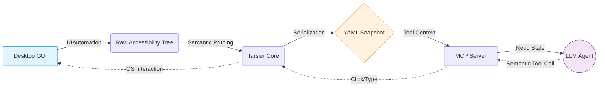

<div align="center">
  <h1>🐒 Tarsier-AI</h1>
  <p><b>Accessibility Trees as a Portable Semantic Representation for Agentic GUI Control</b></p>
  <p><i>The "Playwright" for Windows Desktop Apps.</i></p>

  [](https://pypi.org/project/tarsier-ai/)
  [](https://opensource.org/licenses/MIT)
  [](#) *(Paper Coming Soon)*
</div>

---

## 🎯 What is Tarsier-AI?

Tarsier is an open-source **infrastructure layer** designed to provide robust, deterministic interaction with Windows desktop applications for Large Language Models (LLMs). 

Most "AI Computer Use" agents rely on taking screenshots, sending them to expensive vision models, and guessing X/Y pixel coordinates to click. This results in high inference latency, coordinate brittleness, and massive token consumption.

**Tarsier takes a fundamentally different approach.** 

Instead of screenshots, Tarsier hooks directly into the **Windows UI Automation (UIA) accessibility layer**. It extracts the exact structure of the application, semantically prunes it, and compresses it into a highly token-efficient **YAML ARIA-Snapshot** (the "Desktop DOM"). This allows LLMs to interact via deterministic semantic names and roles (e.g., "Click the Save button").

### ✨ Why use Tarsier over Vision Models?
* 🚀 **Zero Vision Models Needed:** Completely eliminates the need for slow, multimodal vision processing.
* 📉 **68% Token Reduction:** By converting raw accessibility JSON into semantic YAML, Tarsier massively condenses the payload context.
* 🎯 **100% Deterministic:** No hallucinated XY coordinates or missed clicks if a window resizes or a button moves.
* 🧠 **LLM Friendly:** Large Language Models are fundamentally text-processing engines. Parsing a semantic YAML tree is their native strength!

---

## ⚙️ The Agentic Execution Pipeline

Tarsier operates as a portable Intermediate Representation (IR) bridging the OS and the LLM via the Model Context Protocol (MCP).



---

## 📉 Token Efficiency: JSON vs YAML

Standard UI automation outputs verbose, deeply nested JSON. Tarsier dynamically prunes redundant nodes and formats the tree into a highly compressed YAML structure (inspired by Playwright).

Our empirical benchmarks across Windows Calculator, Notepad, Paint, and File Explorer demonstrate a **highly consistent ~69.6% reduction** in token consumption.

**Raw JSON (1,210 tokens)**
```json
{
  "role": "group",
  "name": "Standard functions",
  "elements": [
    { "role": "button", "name": "Reciprocal" },
    { "role": "button", "name": "Square" }
  ]
}
```

**Tarsier YAML (391 tokens)**
```yaml
- group "Standard functions":
  - button "Reciprocal"
  - button "Square"
```

---

## 📦 Installation

Install Tarsier directly from PyPI:

```bash
pip install tarsier-ai
```

---

## 🛠️ Usage & Examples

### 1. Opening an App & Dumping the Semantic State
Tarsier serializes the desktop state into a semantic YAML tree. This is exactly what you should feed to your LLM agent.

```python
from tarsier import Desktop

# Initialize with Visual Debugging (Highlights elements in red as they are clicked)
desktop = Desktop(highlight_actions=True)

# Wait for Notepad to open
notepad = desktop.wait_for_window(regex_name="(?i).*Notepad.*")

# Dump the highly-compressed YAML state
print(notepad.to_yaml_snapshot())
```

### 2. Semantic Interaction
You can query elements exactly like you would use query selectors in the browser.

```python
# Generic find by role and name
notepad.find(role="button", name="Save").click()

# Convenience wrappers
notepad.button("Submit").click()
notepad.textbox("Username").type("Hello from Tarsier!")
```

### 3. Window Management
LLMs can easily reorganize their desktop workspace using native OS Transform patterns.

```python
notepad.move(x=100, y=100)
notepad.resize(width=800, height=600)
notepad.maximize()
notepad.close()
```

---

## 🤖 AI Agent Integration (MCP)

Tarsier comes with a built-in **Model Context Protocol (MCP)** server! You can plug Tarsier directly into AI agents like **Claude Desktop** or **Cursor** to let them autonomously control your Windows desktop.

### Available MCP Tools:
* `desktop_open_app`: Launch or attach to a window.
* `desktop_get_ui`: Dumps the token-efficient **YAML snapshot** for the AI to "see" the screen.
* `desktop_click`: Semantically clicks an element.
* `desktop_type`: Types text into an element.
* `desktop_manage_window`: Maximize, minimize, move, resize, or close a window.

### Claude Desktop Integration:
Add Tarsier to your `claude_desktop_config.json`:

```json
{
  "mcpServers": {
    "tarsier": {
      "command": "tarsier-mcp"
    }
  }
}
```

---

## 🛑 Limitations
While Accessibility Trees serve as an excellent Intermediate Representation, they are not universally available.
* ❌ **Hardware Accelerated UIs:** Applications that render custom UI elements (e.g., video games, custom DirectX canvases) return empty accessibility trees.
* ❌ **Electron Apps without A11y:** While VSCode works beautifully, poorly configured Electron apps may not expose their internal DOM to the OS.

---

<div align="center">
  <p>Built with ❤️ for deterministic local AI.</p>
</div>